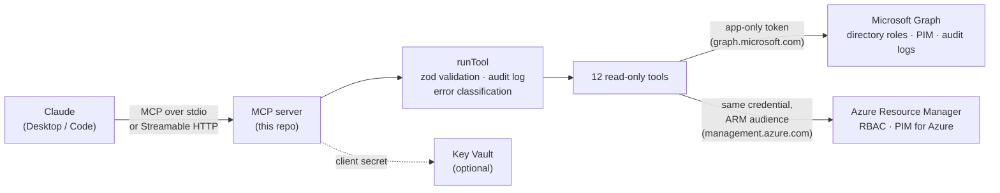

# Entra IAM Review MCP

A **read-only [Model Context Protocol](https://modelcontextprotocol.io) server** that lets Claude answer questions about identity and access in Microsoft Entra ID and Azure, in plain English:

> *"Who holds Global Administrator?"*
> *"What roles does Alex have, including ones they can activate through PIM?"*
> *"Show me every role change in the last two weeks."*
> *"Which Azure subscriptions can this person Owner into, and through which group?"*

It is the bridge between Claude and two Microsoft APIs, **Microsoft Graph** (Entra directory roles) and **Azure Resource Manager** (Azure RBAC and PIM for Azure resources). It was built to make access reviews faster and less error-prone than clicking through the Entra and Azure portals.

**TypeScript · Node 22 · MCP SDK · Microsoft Graph · Azure Resource Manager · Zod · Jest · Docker · Bicep · GitHub Actions**

---

## Why this is interesting

Access review is a good fit for an LLM, but it is a bad place for an LLM to have write access. This project is built around that tension:

- **Read-only by construction, not by convention.** There is no `POST`/`PATCH`/`DELETE` Graph call and no `create*`/`delete*` ARM SDK call anywhere in `src/`. A CI gate greps for mutating calls and fails the build if one appears, so the guarantee is mechanical and not a promise in a README. Even a malicious prompt can at worst *show* data; it cannot change, create, or delete anything.
- **Least privilege, with every grant justified.** Each Graph application permission has a documented reason to exist (see [`SECURITY.md`](SECURITY.md) §3). When a request would have needed a write-named permission, the project took the *reduced-fidelity* read-only path instead, and recorded the trade-off openly.
- **Two API planes, one coherent tool surface.** Entra directory roles (Graph) and Azure RBAC / PIM (ARM) are *separate permission systems* with different tokens, SDKs, and error shapes. One tool, `get_user_group_pim_eligibility`, spans both in a single answer.
- **Honest about limits.** Known issues, including a data-source limitation and one unresolved Azure-side quirk, are documented rather than papered over (see [Known limitations](#known-limitations)).

---

## The tools

Twelve tools, all read-only, all input-validated with Zod.

### Entra directory roles (Microsoft Graph)

| Tool | What it does |
|---|---|
| `search_users` | Fuzzy-find users by name, UPN, or mail. Uses `$search` so a privileged `(Admin) Jordan Lee` account is found alongside `Jordan Lee`. |
| `search_directory_roles` | Search role definitions by name/description, or list them all. |
| `get_role_assignments` | Who holds a given role: users, groups, and service principals, directly *and* transitively through group membership. |
| `get_user_directory_roles` | Everything a person holds: permanent assignments, PIM-eligible, and PIM-active. Aggregates across multiple matching accounts. |
| `explain_directory_role` | What a role can do, plus a curated risk summary for the highest-blast-radius roles. |
| `get_recent_role_changes` | Role changes from the directory audit log, paginated across the full 30-day retention window. |
| `assess_role_risk` | Heuristic risk assessment of a role's current holders (e.g. standing, un-time-boxed access to a high-risk role). |
| `get_directory_role_activation_history` | Who has an active PIM activation of a directory role right now, and when it ends. *(Current-state; see limitations.)* |

### Azure RBAC and PIM for Azure resources (Azure Resource Manager)

| Tool | What it does |
|---|---|
| `get_azure_role_assignments` | Standing Azure RBAC assignments (Owner/Contributor/Reader/…) at a subscription or resource group, or across every visible subscription. |
| `get_azure_pim_assignments` | PIM eligible/active state for Azure resources at a scope. |
| `get_azure_role_activation_history` | PIM activation timeline for Azure resources. |
| `get_user_group_pim_eligibility` | PIM-for-Groups eligibility and active membership for a user, cross-referenced (best effort) with the Azure RBAC role each group itself holds. |

Every tool accepts an optional `tenant` selector (tenant GUID or display name) for multi-tenant use.

---

## Architecture



### Design decisions worth calling out

**One credential, two audiences.** The server authenticates as its own app registration using the OAuth client-credentials (app-only) flow via `@azure/identity`. That credential is audience-neutral: Graph and ARM clients each request their own `/.default` scope from it. Adding the whole Azure plane required *zero* new auth code.

**Two transports, one codebase.**
- **stdio** (default): runs locally under Claude Desktop. stdout is reserved for the protocol, so all logging goes to stderr.
- **Streamable HTTP** (opt-in via `MCP_TRANSPORT=http`): hosted on Azure Container Apps. Each caller must present an Entra-issued bearer token, verified with `jose` against the tenant's JWKS (audience + required `iam.read` scope). The server is *stateless*: a fresh `McpServer` per request, so there is no session-affinity problem across replicas.

**Caller identity without signature churn.** Per-request identity (for the audit log, and for future per-user tenant authorization) is threaded through `AsyncLocalStorage` instead of being passed as a parameter through every tool. It reaches both the audit logger and the tenant-selection call site with no signature changes anywhere.

**Multi-tenant with isolation.** Every Graph/ARM client and cache is keyed by tenant ID. Tenant lookup failures return a generic error that deliberately does *not* echo configured tenant names, so the error path can't be used as a tenant-enumeration oracle.

**Resilience to real-world API behavior.** Graph 429s are retried honoring `Retry-After`; the ARM SDK pipeline handles this natively. ARM scans across many subscriptions *degrade gracefully*: if one subscription denies access, the call returns the rest with `accessDeniedForSomeScopes: true`, instead of failing outright. Inherited role assignments (which ARM returns once per subscription) are de-duplicated by Azure's stable assignment ID.

**Structured audit logging.** Every tool call logs timestamp, caller, tool, arguments (secrets stripped), and result status to a single stream (`console.error`), never the token, never the secret.

### Repository layout

```
src/
  index.ts              # entry point; picks stdio vs HTTP
  server/               # MCP server construction + tool registration
  tools/                # one file per tool; shared/ has runTool, error mapping, tenant selector
  graph/                # Microsoft Graph client, throttling, PIM + directory queries
  arm/                  # Azure Resource Manager clients, scope resolution, principal enrichment
  auth/                 # app-only credential; inbound caller-token verification (jose)
  http/                 # Express Streamable HTTP transport, readiness/health
  audit/                # structured logger + AsyncLocalStorage caller context
  config/               # env validation (zod), tenant registry, Key Vault secret loading
  cache/                # keyed in-memory caches for role definitions
  domain/               # curated risk catalog for high-blast-radius roles
tests/
  unit/                 # 37 suites, 251 tests; Graph/ARM fully mocked
  integration/          # opt-in tests against real tenants (never run in CI)
infra/                  # Bicep for Azure Container Apps + runbook
.github/workflows/      # CI (typecheck, tests, read-only gate) and OIDC deploy
```

---

## Security model

The short version (full detail in [`SECURITY.md`](SECURITY.md)):

| Concern | Approach |
|---|---|
| Can it change anything? | No. No mutating Graph/ARM calls exist, and CI enforces it. |
| Permissions | Explicit minimal set of Graph *application* permissions, plus Azure RBAC `Reader`. No `Directory.Read.All`. |
| Secrets | Client secret from `.env` locally or **Key Vault** in production; never logged. Deploys use **GitHub OIDC federation**, so there is no stored deploy credential. |
| Who can call the hosted server? | Entra bearer tokens, verified for issuer, audience, and scope. The token is the caller's *own* identity (MFA/Conditional Access apply, and offboarding revokes access automatically). |
| Input handling | Every tool's input is validated with Zod before any Graph/ARM call is made. |
| Tenant data mixing | Clients and caches are per-tenant. Per-*user* tenant authorization is identified but not yet built, and is documented as a fail-closed seam. |

---

## Getting started

**Prerequisites:** Node 22 (see `.nvmrc`), and an Entra app registration with the permissions listed in `SECURITY.md` §3 (plus Azure RBAC `Reader` at the root management group for the Azure tools).

```bash
git clone https://github.com/Cole-Murray/Azure-MCP.git
cd Azure-MCP
npm ci
cp .env.example .env      # fill in AZURE_TENANT_ID / AZURE_CLIENT_ID / AZURE_CLIENT_SECRET
npm run build
```

Register it with Claude Desktop (stdio):

```json
{
  "mcpServers": {
    "entra-iam-review": {
      "command": "node",
      "args": ["/absolute/path/to/Azure-MCP/dist/index.js"]
    }
  }
}
```

Then ask Claude something like *"who holds Global Administrator?"*.

[`SETUP.md`](SETUP.md) covers the full walkthrough, including connecting to the hosted HTTP deployment from Claude Code and Claude Desktop. [`infra/README.md`](infra/README.md) is the Azure Container Apps runbook.

### Running the tests

```bash
npm run typecheck
npm test                  # unit tests; no network, no credentials needed
RUN_INTEGRATION_TESTS=true npm run test:integration   # real tenants, needs a populated .env
```

CI runs the typecheck, the unit tests, and the read-only-invariant check on every push and PR.

---

## Known limitations

Documented deliberately rather than hidden:

- **`get_directory_role_activation_history` is a current-state snapshot, not a log.** Its data source (`roleAssignmentScheduleInstances`) drops an activation the moment it expires. For genuine history, use `get_recent_role_changes`, which reads the real audit trail (30-day retention). The tool's description states this explicitly.
- **No justification/ticket/approver on directory-role activations.** Graph gates that detail behind a *write*-named permission even for `GET`. Requesting it would have broken the read-only principle, so the project chose reduced fidelity. A fuller implementation remains in the repo, unused, at `src/graph/pimScheduleRequests.ts`.
- **Group holders aren't name-resolved on the directory plane** (a deliberate scope decision).
- **One unresolved Azure-side quirk:** in the author's test environment, a single subscription rejected PIM schedule-instance queries despite an identical Reader grant to its siblings. The code degrades that scope gracefully, but the root cause was never identified.
- **Tenant config is flat env vars** and won't scale to dozens of tenants; the seam for a Key Vault-backed registry exists (`src/config/tenants.ts`) but is intentionally not built speculatively.
- **No per-user tenant authorization yet.** Any authenticated caller can address any configured tenant.

---

## What I learned building this

A few things that surprised me and are written up in `CLAUDE.md`:

- A permission's *name* can lie about its read/write boundary. Verify each endpoint's real requirement independently instead of inferring from a sibling.
- A masked error can hide a real one. Node's `fetch` sends `Accept-Language: *`, which Graph's PIM endpoints reject with an error that looks exactly like a licensing problem. Fixing the header exposed the true cause underneath (a missing permission).
- Azure doesn't always signal "insufficient permission" with a 403. Some endpoints return a `400` with `code: InsufficientPermissions`, which broke my degrade-gracefully logic until I widened the classifier.
- ARM returns inherited assignments once per subscription, so naive aggregation shows the same root-scope assignment 18 times. The right dedupe key is Azure's own assignment ID, not a tuple of fields.

---

## Documentation

| File | Contents |
|---|---|
| [`SETUP.md`](SETUP.md) | Local dev and connecting Claude clients |
| [`SECURITY.md`](SECURITY.md) | Permission table, threat model, hosted-auth design |
| [`CLAUDE.md`](CLAUDE.md) | Architecture notes, constraints, and lessons learned |
| [`infra/README.md`](infra/README.md) | Azure Container Apps deployment runbook |
| [`v2-multi-tenant-plan.md`](v2-multi-tenant-plan.md) | Design plan for multi-tenant support |

Organization names, tenants, and identifiers throughout this repository are fictional placeholders (Contoso, Fabrikam).

## Author

**Cole Murray**, computer engineering at UIUC.
